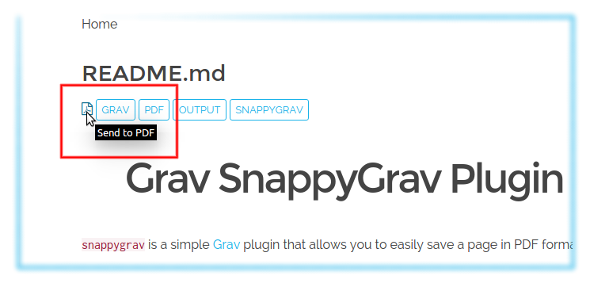

# grav-plugin-snappygrav
SnappyGrav Plugin for Grav CMS (getgrav.org)
# Grav SnappyGrav Plugin

`snappygrav` is a simple [Grav](http://github.com/getgrav/grav) plugin that allows you to easily save a page in PDF format.

# Installation

Installing the `SnappyGrav` plugin can be done in one of two ways. Our GPM (Grav Package Manager) installation method enables you to quickly and easily install the plugin with a simple terminal command, while the manual method enables you to do so via a zip file.

## GPM Installation (Preferred)

The simplest way to install this plugin is via the [Grav Package Manager (GPM)](http://learn.getgrav.org/advanced/grav-gpm) through your system's Terminal (also called the command line).  From the root of your Grav install type:

    $ bin/gpm install snappygrav

This will install the `SnappyGrav` plugin into your `/user/plugins` directory within Grav. Its files can be found under `/your/site/grav/user/plugins/snappygrav`.

## Manual Installation

To install this plugin, just download the zip version of this repository and unzip it under `/your/site/grav/user/plugins`. Then, rename the folder to `snappygrav`. You can find these files either on [GitHub](https://github.com/iusvar/grav-plugin-snappygrav) or via [GetGrav.org](http://getgrav.org/downloads/plugins#extras).

You should now have all the plugin files under

    /your/site/grav/user/plugins/snappygrav

>> NOTE: This plugin is a modular component for Grav which requires [Grav](http://github.com/getgrav/grav) to function

## Requirements

In order to use the `snappygrav` plugin you will have to install:

* [KnpLabs Snappy](https://github.com/KnpLabs/snappy), the PHP5 library allowing thumbnail, snapshot or PDF generation from a url or a html page. The library Snappy is a product of [Matthieu Bontemps](https://github.com/mbontemps) of [KNP Labs](http://KNPLabs.ch), released under the MIT License.
* [Wkhtmltopdf](http://wkhtmltopdf.org/), the open source (LGPLv3) command line tools to render HTML into PDF (minimum version required 0.12.x). The Wkhtmltopdf project maintained by [Ashish Kulkarni](https://github.com/ashkulz), originally created by [Jakob Truelsen](https://github.com/antialize), released under open source License (LGPLv3)

The simplest way to install these libraries is via [Composer](http://getcomposer.org/). Regarding Snappy from the root of your Grav install type:

    $ composer require knplabs/knp-snappy

While for wkhtmltopdf, for i386, as follows:

    $ composer require h4cc/wkhtmltopdf-i386

For amd64 replace with wkhtmltopdf-amd64.

> Note: Binaries for Microsoft Windows, also installable with composer, can be found here: [github.com/wemersonjanuario/wkhtmltopdf-windows](https://github.com/wemersonjanuario/wkhtmltopdf-windows). Sorry unproved, I live in Ubuntu :-)

# Usage

The `snappygrav` plugin to include images requires a `true` value for the `Absolute URLs` in the `/your/site/grav/user/config/system.yaml` file. If you are using `Admin` plugin select the following links: `Configuration`, `System`, `Yes` for `Absolute URLs` and save.

The `snappygrav` plugin must be included into your theme. where you want to display the PDF icon, as follows:

    
        <a href="{{ page.url }}:pdf" title="Send to PDF"><i class="fa fa-file-pdf-o"></i></a>
    

For now I have tested the `snappygrav` plugin for two types of sites, with the Blog Site skeleton with Antimatter theme and RTFM Site skeleton with Learn2 theme.

## Settings Defaults

You can do this configuration in the plugin's configuration.  Simply copy the `user/plugins/snappygrav/snappygrav.yaml` into `user/config/plugins/snappygrav.yaml` and make your modifications.

```
enabled: true           # global enable/disable the entire plugin
wk_path: ''             # Default 'usr/bin/wkhtmltopdf-i386'
grayscale: false        # PDF will be generated in grayscale if true (default = false)
margin_bottom: 10       # Set the page bottom margin (<unitreal> default 10mm)
margin_left: 10         # Set the page left margin (<unitreal> default 10mm)
margin_right: 10        # Set the page right margin (<unitreal> default 10mm)
margin_top: 10          # Set the page top margin (<unitreal> default 10mm)
orientation: Portrait   # Set orientation to Landscape or Portrait
page_size: A4           # Set paper <size> to: A4, Letter, etc.
title: true             # I prefer True or False, getting title from site page
zoom: 1                 # Use this zoom factor (<float> default 1)
```

> Note: The expected values for the Paper Size are really many, to know what you are going to read them directly in the [source file](https://github.com/wkhtmltopdf/wkhtmltopdf/blob/master/src/lib/pdfsettings.cc) from line 174 to line 203.

## Complete PDF

You can print your all site as a PDF by replacing :pdf by :completepdf in the url :

    
        <a href="{{ page.url }}:completepdf" title="Get a complete PDF"><i class="fa fa-file-pdf-o"></i></a>
    

> Warning : it as been tested for a standard installation, on a 50+ pages grav website.

# Customizing the Settings

# Creating a "SnappyGrav" Link



In our [Blog Skeleton](http://demo.getgrav.org/blog-skeleton/) we placed a link in the blog item that pulls up a request to produce a pdf file. Here is the code we used in the `blog_item.html.twig` template file to create this link.

# Updating

As development for the `SnappyGrav` plugin continues, new versions may become available that add additional features and functionality, improve compatibility with newer Grav releases, and generally provide a better user experience, and complete the management of the options, provided by the binary wkhtmltopdf. Very important to do will be managing through twig template. Updating `SnappyGrav` is easy, and can be done through Grav's GPM system, as well as manually.

## GPM Update (Preferred)

The simplest way to update this plugin is via the [Grav Package Manager (GPM)](http://learn.getgrav.org/advanced/grav-gpm). You can do this with this by navigating to the root directory of your Grav install using your system's Terminal (also called command line) and typing the following:

    bin/gpm update snappygrav

This command will check your Grav install to see if your `SnappyGrav` plugin is due for an update. If a newer release is found, you will be asked whether or not you wish to update. To continue, type `y` and hit enter. The plugin will automatically update and clear Grav's cache.

## Manual Update

Manually updating `SnappyGrav` is pretty simple. Here is what you will need to do to get this done:

* Delete the `your/site/user/plugins/snappygrav` directory.
* Download the new version of the `SnappyGrav` plugin from either [GitHub](https://github.com/iusvar/grav-plugin-snappygrav) or [GetGrav.org](http://getgrav.org/downloads/plugins#extras).
* Unzip the zip file in `your/site/user/plugins` and rename the resulting folder to `snappygrav`.
* Clear the Grav cache. The simplest way to do this is by going to the root Grav directory in terminal and typing `bin/grav clear-cache`.

> Note: Any changes you have made to any of the files listed under this directory will also be removed and replaced by the new set. Any files located elsewhere (for example a YAML settings file placed in `user/config/plugins`) will remain intact.
